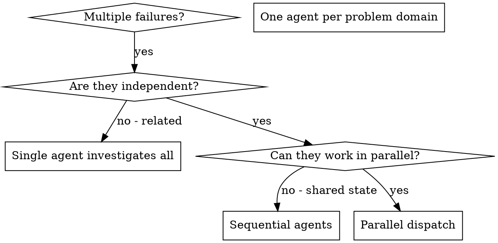

# Dispatching Parallel Agents

## Overview

When you have multiple unrelated failures (different test files, different subsystems, different bugs), investigating them sequentially wastes time. Each investigation is independent and can happen in parallel.

**Core principle:** Dispatch one agent per independent problem domain. Let them work concurrently.

## When to Use



**Use when:**
- 3+ test files failing with different root causes
- Multiple subsystems broken independently
- Each problem can be understood without context from others
- No shared state between investigations
- For tasks requiring decomposition of large inputs (10+ files, 50k+ tokens), combine with the `recursive-decomposition` skill for chunking and filtering strategies before dispatching parallel agents

**Don't use when:**
- Failures are related (fix one might fix others)
- Need to understand full system state
- Agents would interfere with each other

## The Pattern

### 1. Identify Independent Domains

Group failures by what's broken:
- File A tests: Tool approval flow
- File B tests: Batch completion behavior
- File C tests: Abort functionality

Each domain is independent - fixing tool approval doesn't affect abort tests.

### 2. Create Focused Agent Tasks

Each agent gets:
- **Specific scope:** One test file or subsystem
- **Clear goal:** Make these tests pass
- **Constraints:** Don't change other code
- **Expected output:** Summary of what you found and fixed

### 3. Dispatch in Parallel

```
Task("Fix internal/agent/abort_test.go failures")
Task("Fix internal/agent/batch_test.go failures")
Task("Fix internal/agent/approval_test.go failures")
// All three run concurrently
```

### 4. Review and Integrate

When agents return:
- Read each summary
- Verify fixes don't conflict
- Run full test suite
- Integrate all changes

## Agent Prompt Structure

Good agent prompts are:
1. **Focused** - One clear problem domain
2. **Self-contained** - All context needed to understand the problem
3. **Specific about output** - What should the agent return?

```markdown
Fix the 3 failing tests in internal/agent/abort_test.go:

1. TestAbortToolPartialOutput - expects 'interrupted at' in message
2. TestAbortMixedCompletedAndAborted - fast tool aborted instead of completed
3. TestAbortPendingToolCount - expects 3 results but gets 0

These are timing/race condition issues. Your task:

1. Read the test file and understand what each test verifies
2. Identify root cause - timing issues or actual bugs?
3. Fix by:
   - Replacing arbitrary timeouts with event-based waiting
   - Fixing bugs in abort implementation if found
   - Adjusting test expectations if testing changed behavior

Do NOT just increase timeouts - find the real issue.

Return: Summary of what you found and what you fixed.
```

## Common Mistakes

**BAD - Too broad:** "Fix all the tests" - agent gets lost
**GOOD - Specific:** "Fix internal/agent/abort_test.go" - focused scope

**BAD - No context:** "Fix the race condition" - agent doesn't know where
**GOOD - Context:** Paste the error messages and test names

**BAD - No constraints:** Agent might refactor everything
**GOOD - Constraints:** "Do NOT change production code" or "Fix tests only"

**BAD - Vague output:** "Fix it" - you don't know what changed
**GOOD - Specific:** "Return summary of root cause and changes"

## When NOT to Use

**Related failures:** Fixing one might fix others - investigate together first
**Need full context:** Understanding requires seeing entire system
**Exploratory debugging:** You don't know what's broken yet
**Shared state:** Agents would interfere (editing same files, using same resources)

## Real Example from Session

**Scenario:** 6 test failures across 3 files after major refactoring

**Failures:**
- internal/agent/abort_test.go: 3 failures (timing issues)
- internal/agent/batch_test.go: 2 failures (tools not executing)
- internal/agent/approval_test.go: 1 failure (execution count = 0)

**Decision:** Independent domains - abort logic separate from batch completion separate from race conditions

**Dispatch:**
```
Agent 1 → Fix internal/agent/abort_test.go
Agent 2 → Fix internal/agent/batch_test.go
Agent 3 → Fix internal/agent/approval_test.go
```

**Results:**
- Agent 1: Replaced timeouts with event-based waiting
- Agent 2: Fixed event structure bug (threadId in wrong place)
- Agent 3: Added wait for async tool execution to complete

**Integration:** All fixes independent, no conflicts, full suite green

**Time saved:** 3 problems solved in parallel vs sequentially

## Task Subsystem for Tracking Dispatched Agents

Use TaskCreate/TaskUpdate/TaskList to track parallel agent work:

### Pattern: Task-per-Agent Tracking

```
# 1. Create tasks for each agent's work item
TaskCreate("Fix abort_test.go failures")
TaskCreate("Fix batch_test.go failures")
TaskCreate("Fix approval_test.go failures")

# 2. Mark in_progress when dispatching
TaskUpdate(taskId: "1", status: "in_progress")

# 3. Dispatch agents in parallel
Task("Fix internal/agent/abort_test.go failures")
Task("Fix internal/agent/batch_test.go failures")
Task("Fix internal/agent/approval_test.go failures")

# 4. As each agent returns, mark completed
TaskUpdate(taskId: "1", status: "completed")

# 5. TaskList to show remaining work
TaskList()
```

### Dependencies Prevent Premature Dispatch

When tasks have dependencies, use `addBlockedBy` to prevent premature parallel dispatch:

```
TaskCreate("Implement interfaces")        # Task 1
TaskCreate("Implement handler")           # Task 2
TaskUpdate(taskId: "2", addBlockedBy: ["1"])  # Task 2 waits for Task 1

# Only dispatch Task 2's agent after Task 1 completes
```

## Key Benefits

1. **Parallelization** - Multiple investigations happen simultaneously
2. **Focus** - Each agent has narrow scope, less context to track
3. **Independence** - Agents don't interfere with each other
4. **Speed** - 3 problems solved in time of 1
5. **Visibility** - TaskList shows real-time progress across all agents

## Verification

After agents return:
1. **Review each summary** - Understand what changed
2. **Check for conflicts** - Did agents edit same code?
3. **Run full suite** - Verify all fixes work together
4. **Spot check** - Agents can make systematic errors

## Real-World Impact

From debugging session (2025-10-03):
- 6 failures across 3 files
- 3 agents dispatched in parallel
- All investigations completed concurrently
- All fixes integrated successfully
- Zero conflicts between agent changes
