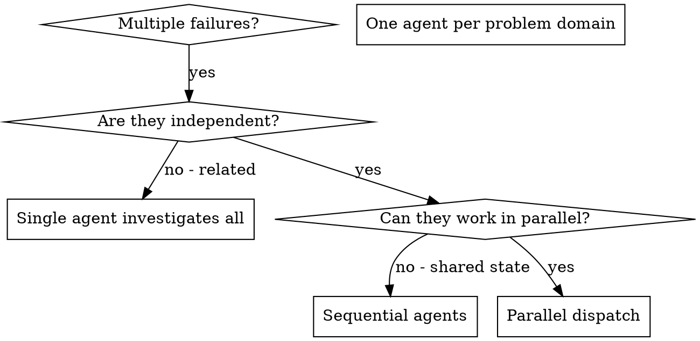

# Dispatching Parallel Agents

Dispatch one agent per independent problem domain. Let them work concurrently.

## When to Use



**Use when:**
- 3+ test files failing with different root causes
- Multiple subsystems broken independently
- Each problem can be understood without context from others
- No shared state between investigations
- For large inputs (10+ files, 50k+ tokens), combine with `recursive-decomposition` for chunking before dispatch

**Don't use when:**
- Failures are related (fix one might fix others)
- Need to understand full system state
- Agents would interfere with each other (editing same files, using same resources)
- Exploratory debugging where you don't know what's broken yet

## The Pattern

### 1. Identify Independent Domains

Group failures by what's broken:
- File A tests: Tool approval flow
- File B tests: Batch completion behavior
- File C tests: Abort functionality

Each domain is independent - fixing tool approval doesn't affect abort tests.

### 2. Create Focused Agent Tasks

Each agent gets:
- **Specific scope:** One test file or subsystem
- **Clear goal:** Make these tests pass
- **Constraints:** Don't change other code
- **Expected output:** Summary of what you found and fixed

### 3. Dispatch in Parallel

```
Task("Fix internal/agent/abort_test.go failures")
Task("Fix internal/agent/batch_test.go failures")
Task("Fix internal/agent/approval_test.go failures")
// All three run concurrently
```

### 4. Review and Integrate

When agents return:
- Read each summary
- Verify fixes don't conflict
- Run full test suite
- Integrate all changes

## Agent Prompt Structure

Good agent prompts are:
1. **Focused** - One clear problem domain
2. **Self-contained** - All context needed to understand the problem
3. **Specific about output** - What should the agent return?

```markdown
Fix the 3 failing tests in internal/agent/abort_test.go:

1. TestAbortToolPartialOutput - expects 'interrupted at' in message
2. TestAbortMixedCompletedAndAborted - fast tool aborted instead of completed
3. TestAbortPendingToolCount - expects 3 results but gets 0

These are timing/race condition issues. Your task:

1. Read the test file and understand what each test verifies
2. Identify root cause - timing issues or actual bugs?
3. Fix by:
   - Replacing arbitrary timeouts with event-based waiting
   - Fixing bugs in abort implementation if found
   - Adjusting test expectations if testing changed behavior

Do NOT just increase timeouts - find the real issue.

Return: Summary of what you found and what you fixed.
```

## Common Mistakes

**BAD - Too broad:** "Fix all the tests" - agent gets lost
**GOOD - Specific:** "Fix internal/agent/abort_test.go" - focused scope

**BAD - No context:** "Fix the race condition" - agent doesn't know where
**GOOD - Context:** Paste the error messages and test names

**BAD - No constraints:** Agent might refactor everything
**GOOD - Constraints:** "Do NOT change production code" or "Fix tests only"

**BAD - Vague output:** "Fix it" - you don't know what changed
**GOOD - Specific:** "Return summary of root cause and changes"

## Task Tracking

Use TaskCreate/TaskUpdate/TaskList to track dispatched agents. Create one task per agent, mark `in_progress` on dispatch, `completed` on return. Use `addBlockedBy` for tasks with dependencies to prevent premature dispatch.

## Verification

After agents return:
1. **Review each summary** - Understand what changed
2. **Check for conflicts** - Did agents edit same code?
3. **Run full suite** - Verify all fixes work together
4. **Spot check** - Agents can make systematic errors
