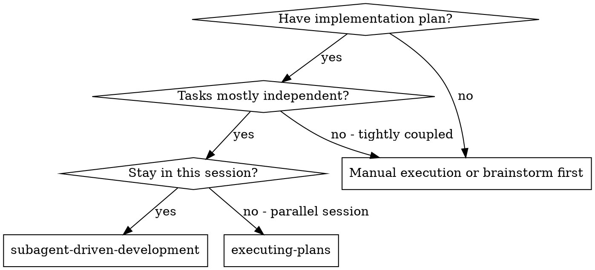
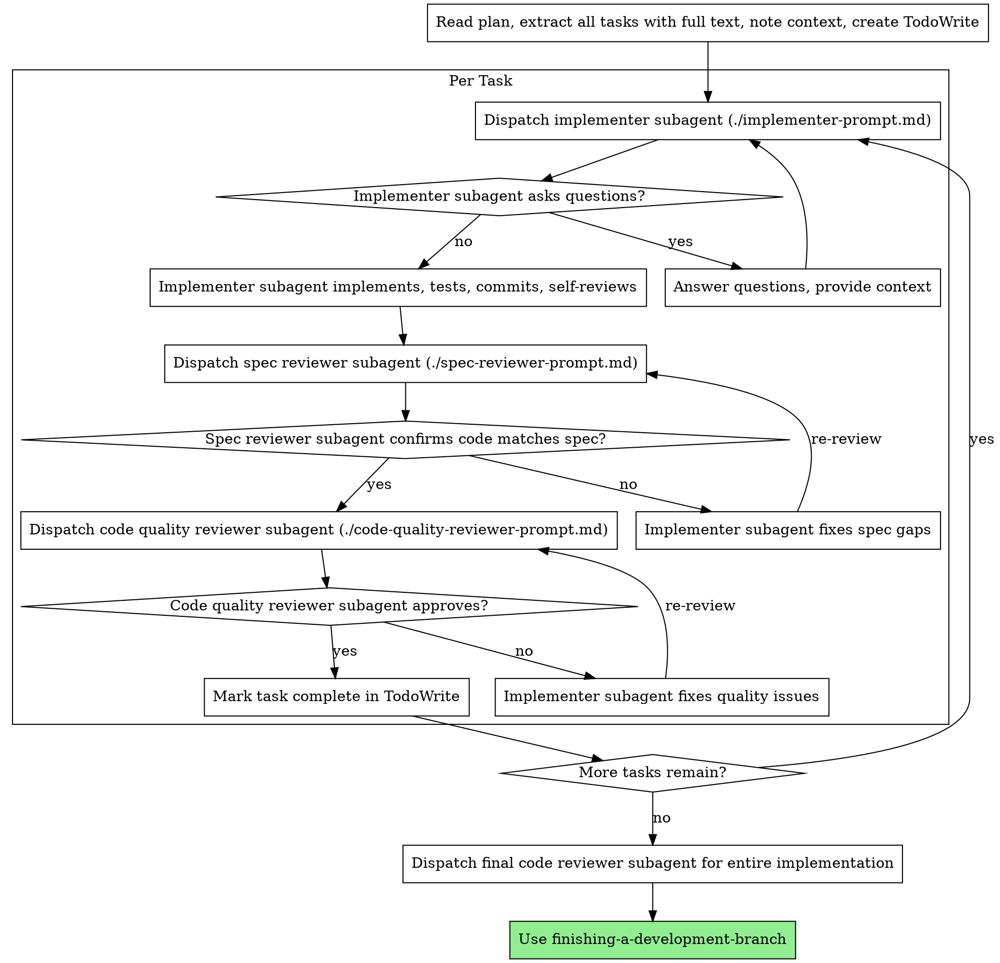

# Subagent-Driven Development

Execute plan by dispatching fresh subagent per task, with two-stage review after each: spec compliance review first, then code quality review.

**Core principle:** Fresh subagent per task + two-stage review (spec then quality) = high quality, fast iteration

## When to Use



**vs. Executing Plans (parallel session):**
- Same session (no context switch)
- Fresh subagent per task (no context pollution)
- Two-stage review after each task: spec compliance first, then code quality
- Faster iteration (no human-in-loop between tasks)

## The Process



## Prompt Templates

- `./implementer-prompt.md` - Dispatch implementer subagent
- `./spec-reviewer-prompt.md` - Dispatch spec compliance reviewer subagent
- `./code-quality-reviewer-prompt.md` - Dispatch code quality reviewer subagent

## Example Workflow

```
[Read plan file once, extract all tasks with full text and context]
[Create TodoWrite with all tasks]

Task 1: Hook installation script
  [Dispatch implementer with full task text + context]
  Implementer asks: "User or system level?" -> Answer: "User level"
  Implementer: Implements, tests pass, self-reviews, commits
  [Dispatch spec reviewer] -> Spec compliant
  [Dispatch code quality reviewer] -> Approved
  [Mark Task 1 complete]

Task 2: Recovery modes
  [Dispatch implementer] -> Implements, tests pass, commits
  [Dispatch spec reviewer] -> Missing progress reporting, extra --json flag
  [Implementer fixes] -> Removes --json, adds progress reporting
  [Re-review spec] -> Spec compliant now
  [Dispatch code quality reviewer] -> Magic number issue
  [Implementer fixes] -> Extracts constant
  [Re-review quality] -> Approved
  [Mark Task 2 complete]

... (repeat for remaining tasks)

[Dispatch final code-reviewer for entire implementation]
[Use finishing-a-development-branch]
```

## Red Flags

**Never:**
- Start implementation on main/master without explicit user consent
- Skip reviews (spec compliance OR code quality)
- Proceed with unfixed issues
- Dispatch multiple implementation subagents in parallel (conflicts)
- Make subagent read plan file (provide full text instead)
- Skip scene-setting context
- Accept "close enough" on spec compliance
- **Start code quality review before spec compliance passes**
- Move to next task while either review has open issues

**If subagent asks questions:**
- Answer clearly and completely
- Provide additional context if needed
- Don't rush them into implementation

**If reviewer finds issues:**
- Implementer (same subagent) fixes them
- Reviewer reviews again
- Repeat until approved

**If subagent fails task:**
- Dispatch fix subagent with specific instructions
- Don't fix manually (context pollution)

## Integration

**Required workflow skills:**
- **using-git-worktrees** - REQUIRED: Set up isolated workspace before starting
- **writing-plans** - Creates the plan this skill executes
- **requesting-code-review** - Code review template for reviewer subagents
- **finishing-a-development-branch** - Complete development after all tasks

**Subagents should use:**
- **tdd-workflow** - Subagents follow TDD for each task

**Alternative workflow:**
- **executing-plans** - Use for parallel session instead of same-session execution
