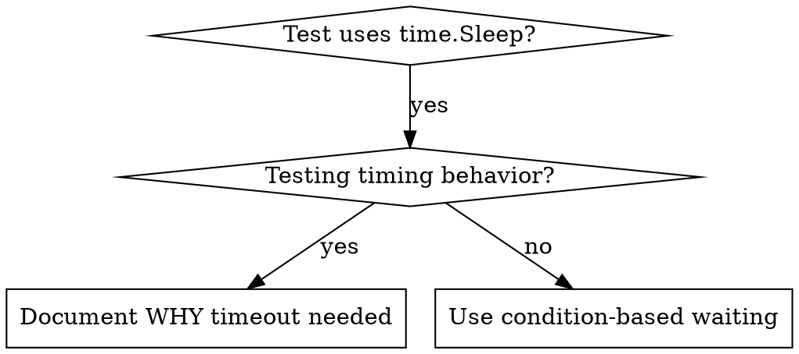

# Condition-Based Waiting

## Overview

Flaky tests often guess at timing with arbitrary delays. This creates race conditions where tests pass on fast machines but fail under load or in CI.

**Core principle:** Wait for the actual condition you care about, not a guess about how long it takes.

## When to Use



**Use when:**
- Tests have arbitrary delays (`time.Sleep`)
- Tests are flaky (pass sometimes, fail under load)
- Tests timeout when run in parallel
- Waiting for async operations (goroutines, channels) to complete

**Don't use when:**
- Testing actual timing behavior (debounce, throttle intervals)
- Always document WHY if using arbitrary timeout

## Core Pattern

```go
// BEFORE: Guessing at timing
time.Sleep(50 * time.Millisecond)
result := getResult()
require.NotNil(t, result)

// AFTER: Waiting for condition
require.Eventually(t, func() bool {
    return getResult() != nil
}, 5*time.Second, 10*time.Millisecond)
result := getResult()
require.NotNil(t, result)
```

## Quick Patterns

| Scenario | Pattern |
|----------|---------|
| Wait for channel | `select { case v := <-ch: ... case <-time.After(5*time.Second): t.Fatal("timeout") }` |
| Wait for state | `require.Eventually(t, func() bool { return obj.State() == "ready" }, ...)` |
| Wait for count | `require.Eventually(t, func() bool { return len(items) >= 5 }, ...)` |
| Wait for file | `require.Eventually(t, func() bool { _, err := os.Stat(path); return err == nil }, ...)` |
| Wait for goroutine | `var wg sync.WaitGroup; wg.Wait()` with timeout via channel |

## Implementation

Generic polling function (when `require.Eventually` isn't sufficient):

```go
// waitForCondition polls until condition returns true or timeout expires.
func waitForCondition(t *testing.T, description string, timeout, interval time.Duration, condition func() bool) {
    t.Helper()

    deadline := time.After(timeout)
    ticker := time.NewTicker(interval)
    defer ticker.Stop()

    for {
        if condition() {
            return
        }

        select {
        case <-deadline:
            t.Fatalf("timeout waiting for %s after %v", description, timeout)
        case <-ticker.C:
            // try again
        }
    }
}
```

Channel-based waiting (preferred for goroutine coordination):

```go
// waitForEvent waits for a value on a channel or times out.
func waitForEvent[T any](t *testing.T, ch <-chan T, timeout time.Duration) T {
    t.Helper()

    select {
    case v := <-ch:
        return v
    case <-time.After(timeout):
        var zero T
        t.Fatalf("timeout waiting for event after %v", timeout)
        return zero
    }
}
```

See `condition-based-waiting-example_test.go` in this directory for complete implementation with domain-specific helpers from actual debugging session.

## Common Mistakes

**Polling too fast:** `time.NewTicker(1 * time.Millisecond)` - wastes CPU
**Fix:** Poll every 10-50ms depending on expected latency

**No timeout:** Infinite loop if condition never met
**Fix:** Always include timeout with clear error via `t.Fatalf`

**Stale data:** Caching state before loop
**Fix:** Call getter inside condition function for fresh data

**Using `time.Sleep` in goroutine tests:** Race between sleep and goroutine completion
**Fix:** Use channels or `sync.WaitGroup` for synchronization

## When Arbitrary Timeout IS Correct

```go
// Ticker fires every 100ms - need 2 ticks to verify partial output
waitForCondition(t, "ticker started", 5*time.Second, 10*time.Millisecond, func() bool {
    return tickerStarted.Load()
})
time.Sleep(200 * time.Millisecond) // 2 ticks at 100ms intervals - documented and justified
```

**Requirements:**
1. First wait for triggering condition
2. Based on known timing (not guessing)
3. Comment explaining WHY

## Testify Integration

The `require.Eventually` and `assert.Eventually` functions from testify are the preferred approach for most condition-based waiting in tests:

```go
// Wait up to 5s, polling every 10ms
require.Eventually(t, func() bool {
    return store.IsReady()
}, 5*time.Second, 10*time.Millisecond, "store should become ready")

// For negation: wait to confirm something does NOT happen
require.Never(t, func() bool {
    return store.HasError()
}, 500*time.Millisecond, 10*time.Millisecond, "store should not error")
```

## Real-World Impact

From debugging session:
- Fixed 15 flaky tests across 3 files
- Pass rate: 60% → 100%
- Execution time: 40% faster
- No more race conditions
