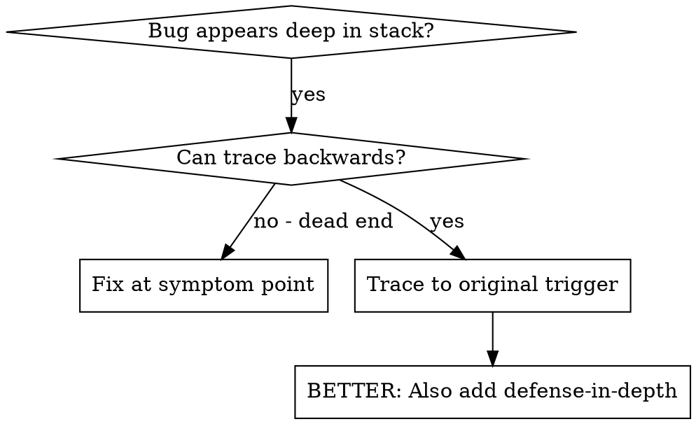
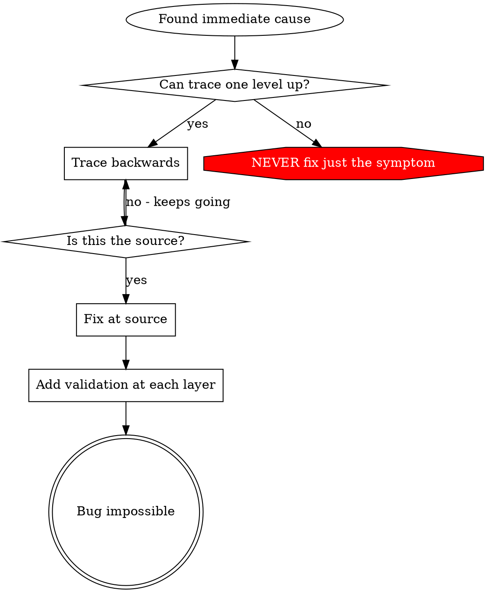

# Root Cause Tracing

## Overview

Bugs often manifest deep in the call stack (database opened with wrong path, config loaded from wrong location, contract called with wrong address). Your instinct is to fix where the error appears, but that's treating a symptom.

**Core principle:** Trace backward through the call chain until you find the original trigger, then fix at the source.

## When to Use



**Use when:**
- Error happens deep in execution (not at entry point)
- Stack trace shows long call chain
- Unclear where invalid data originated
- Need to find which test/code triggers the problem

## The Tracing Process

### 1. Observe the Symptom
```
Error: failed to connect to RPC: dial tcp 127.0.0.1:8545: connection refused
```

### 2. Find Immediate Cause
**What code directly causes this?**
```go
ethClient, err := ethclient.Dial(rpcURL)
// rpcURL is empty or wrong
```

### 3. Ask: What Called This?
```go
analyzer.Connect(cfg.RPCURL)
  → called by cmd.RunAnalyze(cfg)
  → called by analyzeCmd.RunE(cmd, args)
  → called by cobra command execution
```

### 4. Keep Tracing Up
**What value was passed?**
- `cfg.RPCURL = ""` (empty string!)
- Empty string causes default `http://127.0.0.1:8545`
- No local node running → connection refused

### 5. Find Original Trigger
**Where did empty string come from?**
```go
// viper.GetString("rpc_url") returns "" because:
// 1. No --rpc-url flag passed
// 2. No QUANTA_RPC_URL env var set
// 3. Config file missing rpc_url key
```

## Adding Stack Traces

When you can't trace manually, add instrumentation:

```go
// Before the problematic operation
func (a *Analyzer) Connect(rpcURL string) error {
    a.logger.Debug("connecting to RPC",
        zap.String("rpc_url", rpcURL),
        zap.String("stack", string(debug.Stack())),
    )

    if rpcURL == "" {
        return fmt.Errorf("rpc_url is empty: caller must provide a valid RPC endpoint")
    }

    client, err := ethclient.Dial(rpcURL)
    // ...
}
```

**Critical:** In tests, use `t.Logf()` for debug output - it only shows when the test fails or with `-v` flag.

```go
func TestAnalyzerConnect(t *testing.T) {
    t.Logf("DEBUG: rpcURL=%q, config=%+v", rpcURL, cfg)
    // ...
}
```

**Run and capture:**
```bash
go test -v -run TestAnalyzerConnect ./internal/api/ 2>&1 | grep DEBUG
```

**Analyze output:**
- Look for test function names in stack
- Find the line number triggering the call
- Identify the pattern (same test? same parameter?)

## Finding Which Test Causes Pollution

If something appears during tests but you don't know which test:

Use the bisection script `find-polluter.sh` in this directory:

```bash
./find-polluter.sh '.git' '**/*_test.go'
```

Runs tests one-by-one, stops at first polluter. See script for usage.

## Real Example: Empty Config Path

**Symptom:** Store files created in working directory instead of configured path

**Trace chain:**
1. `os.Create(storePath)` uses `""` → resolves to current directory
2. `NewStore(cfg.StorePath)` called with empty string
3. `LoadConfig()` returns empty `StorePath`
4. Viper key mismatch: code reads `store_path`, config has `storePath`
5. `mapstructure` tag missing on struct field

**Root cause:** Struct tag `mapstructure:"store_path"` missing from `Config.StorePath`

**Fix:** Added correct struct tag, config value now propagates

**Also added defense-in-depth:**
- Layer 1: `NewStore()` validates path not empty
- Layer 2: `LoadConfig()` validates required fields after unmarshal
- Layer 3: `testing.Short()` guard refuses writes outside `t.TempDir()` in tests
- Layer 4: Debug logging of resolved paths at startup

## Key Principle



**NEVER fix just where the error appears.** Trace back to find the original trigger.

## Stack Trace Tips

**In tests:** Use `t.Logf()` - output only shows on failure or with `-v`
**Before operation:** Log before the dangerous operation, not after it fails
**Include context:** Path, config values, environment variables, goroutine ID
**Capture stack:** `debug.Stack()` shows complete call chain for current goroutine

## Real-World Impact

From debugging session:
- Found root cause through 5-level trace
- Fixed at source (struct tag)
- Added 4 layers of defense
- All tests passed, zero pollution
