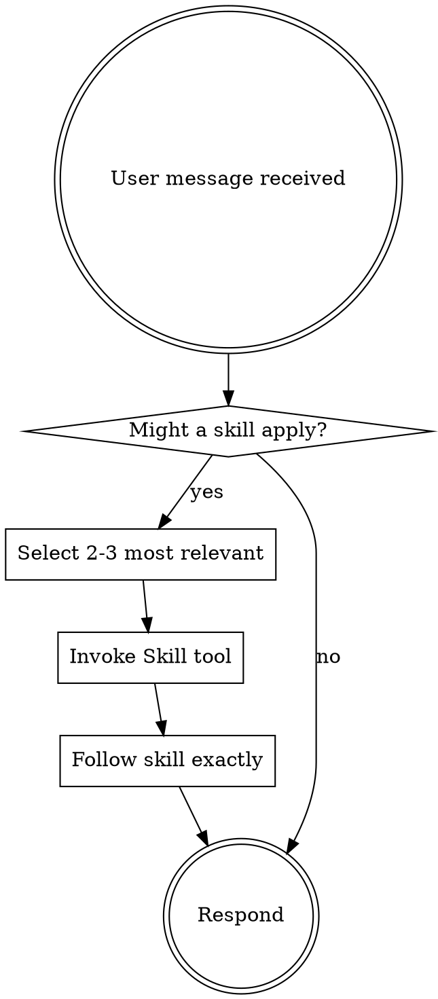

# Using Skills

## The Rule

**Invoke relevant skills BEFORE any response or action.** Load the **2-3 most relevant** skills for the current task. Prioritize project-specific procedural skills over general knowledge.

## How to Access Skills

**In Claude Code:** Use the `Skill` tool. When you invoke a skill, its content is loaded and presented to you—follow it directly. Never use the Read tool on skill files.

## Skill Selection Criteria

When multiple skills could apply, select the **3 strongest procedural fits**:

1. **Load first**: Process skills that determine HOW to approach the task
   - `brainstorming` — before creative work or feature design
   - `systematic-debugging` — before investigating bugs
   - `tdd-workflow` — before writing implementation code

2. **Load second**: Project-specific procedural skills matching the task domain
   - `code-review` — when reviewing code or before commits
   - `verification-before-completion` — before claiming work is done
   - `search-first` — before writing new code or adding dependencies

3. **Skip**: General knowledge skills unless the task involves an unusual pattern
   - Standard Go patterns, error handling, concurrency — already in model pretraining
   - Well-documented library usage (Cobra, Viper, testify)

**If more than 3 skills seem relevant, select the 3 with the strongest procedural fit.** General Go knowledge is already in the model's pretraining.

## Skill Types

**Rigid** (TDD, debugging, verification): Follow exactly. Don't adapt away discipline.

**Flexible** (patterns, philosophy): Adapt principles to context.

The skill itself tells you which.

## Skill Priority

## User Instructions

Instructions say WHAT, not HOW. "Add X" or "Fix Y" doesn't mean skip workflows.
